# 🛡️ Blue Team Home Lab - Phase 1: Linux Detection Engineering with Wazuh

A self-built, fully isolated cybersecurity lab where I launch real attacks against my own systems and then **detect, investigate, and write custom detection rules** for them in a SIEM - the core daily loop of a SOC analyst / detection engineer.

**Phase 1** is a Linux detection lab built around **Wazuh**: three attack classes executed from Kali against a monitored Ubuntu server, each detected end-to-end, plus a **custom detection rule I wrote and validated** and a **new log source I onboarded** myself.

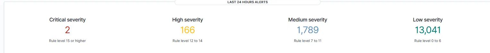
*24-hour alert summary after the exercises: 2 critical, 166 high, 1,789 medium, 13,041 low.*


##  Overview

| | |
|---|---|
| **Goal** | Build hands-on SOC / detection-engineering skills: SIEM operation, log analysis, threat hunting, and custom rule writing. |
| **Focus** | Blue team (detection & response), with offensive actions used only to generate telemetry to detect. |
| **SIEM** | Wazuh 4.14 |
| **Platform** | VMware Workstation on a single 16 GB laptop, fully isolated host-only network |
| **Status** | Phase 1 complete ✅ |

>  **Ethics & scope:** Every action in this lab targets machines I own, on an isolated network with no internet route. Attack tools were used solely to produce logs so I could practise detecting them.


##  Skills Demonstrated

- **SIEM operation** - deployed and operated Wazuh end-to-end: manager, agents, dashboards, alert triage
- **Detection engineering** - wrote, validated, and tuned a **custom Wazuh rule** (composite, frequency-based, same-source-IP)
- **Log source onboarding** - added a new telemetry source (Apache access logs) to the SIEM and fixed the agent read-permission issue
- **Threat hunting** - pivoted on `srcip`, rule groups, and time windows to reconstruct attacks from raw events
- **MITRE ATT&CK mapping** - tied every detection to techniques (T1110, T1595, T1190)
- **Adversary emulation** - Nmap, Hydra, Gobuster, Nikto, sqlmap
- **Infrastructure** - VMware host-only networking, static IP addressing, VM snapshots


## Architecture

All hosts sit on an **isolated host-only network (`10.0.0.0/24`, VMnet2)** with no route to the internet. A temporary NAT adapter was attached only during software installation, then disconnected.

```
                         Host Laptop (16 GB RAM)
   ┌──────────────────────────────────────────────────────────────┐
   │                  VMware Workstation                            │
   │                                                                │
   │   ┌────────────────┐        ┌────────────────┐                │
   │   │  attacker01    │        │   victim01     │                │
   │   │  Kali Linux    │───────▶│  Ubuntu 24.04  │                │
   │   │  10.0.0.130    │ attacks│  10.0.0.20     │                │
   │   │                │        │  Wazuh agent + │                │
   │   │  nmap, hydra,  │        │  Apache + DVWA │                │
   │   │  gobuster,     │        └────────┬───────┘                │
   │   │  nikto, sqlmap │                 │ logs/alerts            │
   │   └────────────────┘                 ▼                        │
   │                            ┌────────────────────┐             │
   │                            │      siem01        │             │
   │                            │  Ubuntu 24.04      │             │
   │                            │  Wazuh 4.14 SIEM   │             │
   │                            │  10.0.0.10         │             │
   │                            └────────────────────┘             │
   │          Host-Only Network - VMnet2 - 10.0.0.0/24 (no WAN)     │
   └──────────────────────────────────────────────────────────────┘
```

| Host | Role | OS | IP | Resources |
|---|---|---|---|---|
| `siem01` | Wazuh manager + dashboard | Ubuntu Server 24.04 LTS | 10.0.0.10 | 6 GB / 4 vCPU / 50 GB |
| `victim01` | Monitored target (SSH, Apache, DVWA) | Ubuntu Server 24.04 LTS | 10.0.0.20 | 2 GB / 2 vCPU / 25 GB |
| `attacker01` | Offensive toolkit | Kali Linux | 10.0.0.130 | 2 GB / 4 vCPU |

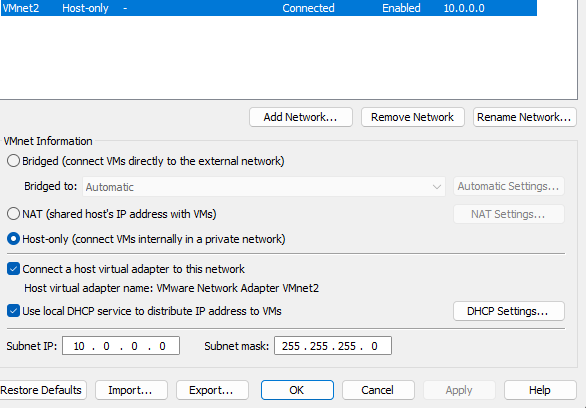
*Isolated host-only network (VMnet2, 10.0.0.0/24) - the lab has no internet route.*


##  Lab Build

### SIEM server (`siem01`)

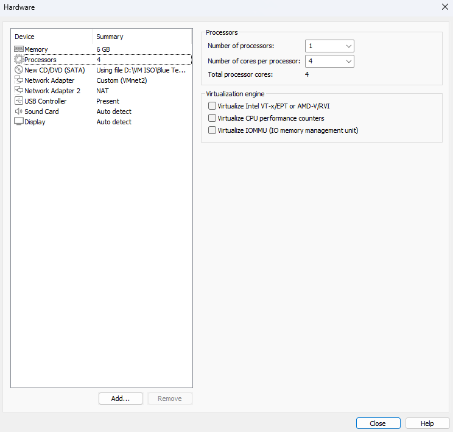
*siem01 VM: 6 GB RAM, 4 vCPU, dual NIC (VMnet2 for the lab + a temporary NAT adapter for installation only).*

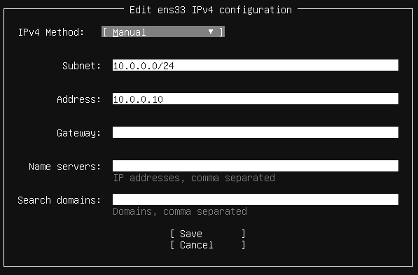
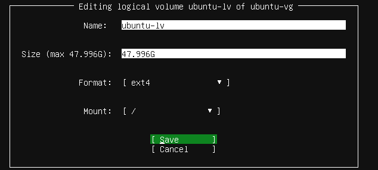
*Static IP `10.0.0.10/24` with no gateway on the lab NIC (so internet stays on the NAT adapter), and the LVM volume expanded to full disk for Wazuh.*

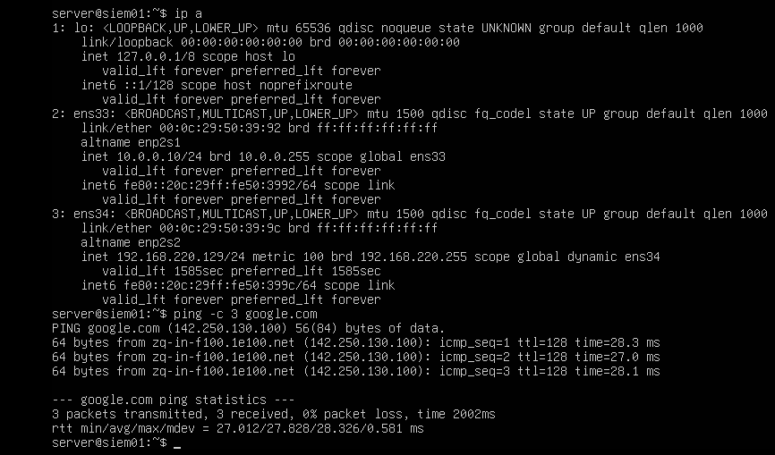
*Both interfaces up and internet reachable via NAT during setup.*

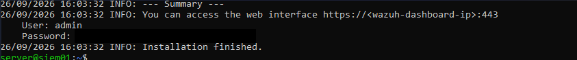
*Wazuh 4.14 all-in-one install finished. (Admin credentials redacted.)*

### Monitored host (`victim01`)

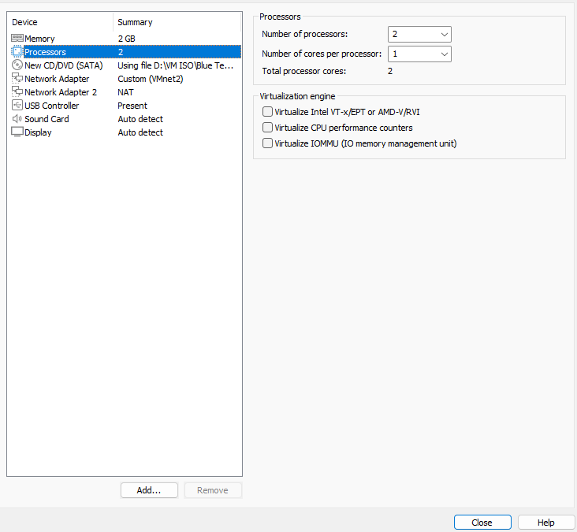
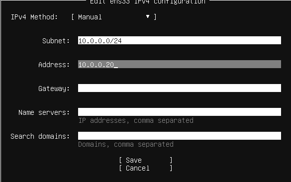
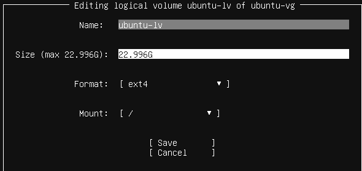
*victim01 VM: 2 GB RAM, static IP `10.0.0.20/24`.*

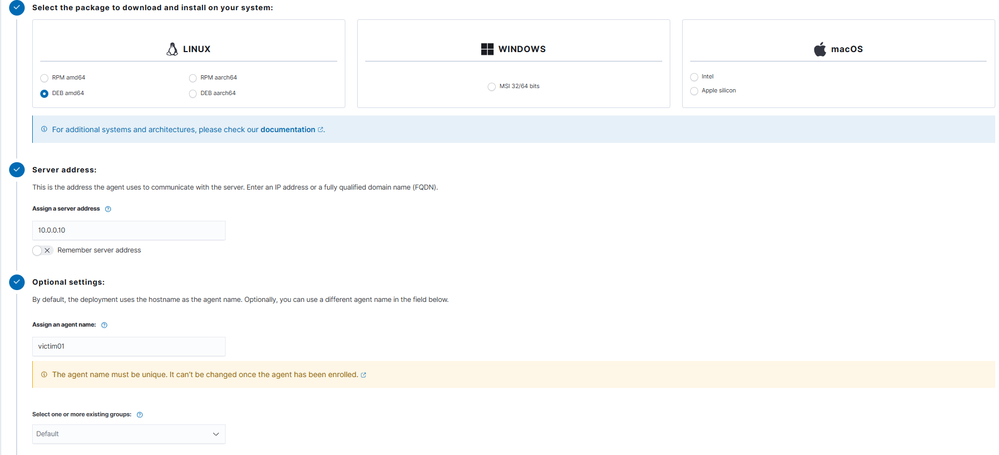
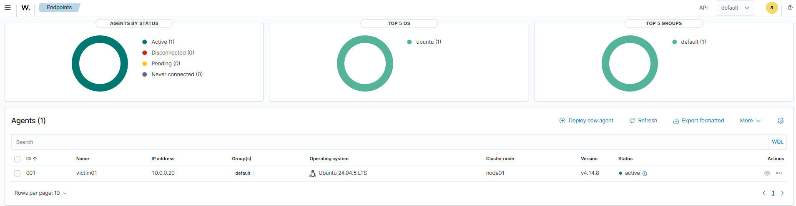
*Wazuh agent deployed to victim01 and reporting to the manager - status **Active**, Ubuntu 24.04.5, agent v4.14.8.*

### Attacker (`attacker01`)

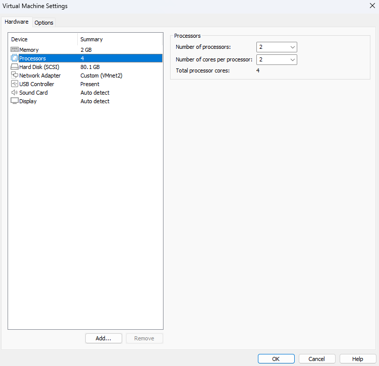
*Kali attacker on VMnet2 only - no NAT, so the attacker is fully air-gapped from the internet.*


##  Detection Exercises

Each exercise follows the same loop: **attack from Kali → hunt it in Wazuh → map to MITRE ATT&CK → (where applicable) write a detection rule.**

### Exercise 1: SSH Brute Force + Custom Detection Rule 

**Attack.** Nmap recon found SSH open; Hydra then brute-forced a deliberately weak test account (`jan`).

```bash
nmap -sV 10.0.0.20
hydra -l jan -P /usr/share/wordlists/rockyou.txt ssh://10.0.0.20
```

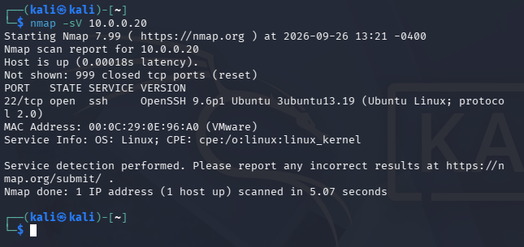
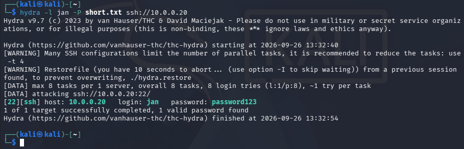
*Nmap finds OpenSSH 9.6p1; Hydra recovers `jan : password123`.*

**Detect.** Wazuh flagged the flood of failed logins: 235 auth events from `10.0.0.130` in seconds.

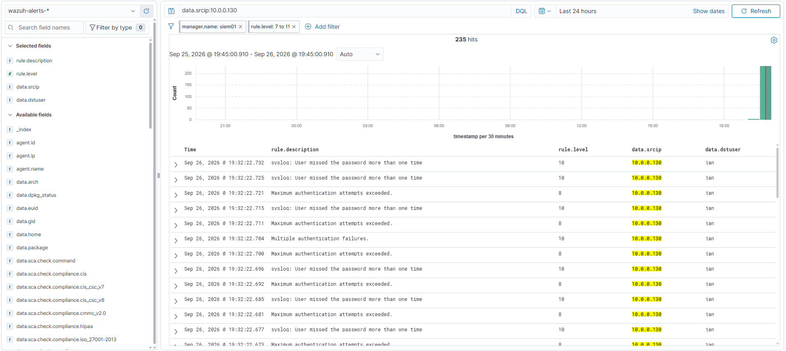
*Every failed login from the attacker, attributed to `data.srcip 10.0.0.130`, user `jan`.*

**Engineering.** I wrote a **custom rule** that fires only on a genuine brute-force pattern. 6+ failed logins from the *same source IP* within 60 seconds at higher severity (level 12) than the built-in rule, with MITRE tag:

```xml
<rule id="100100" level="12" frequency="6" timeframe="60">
  <if_matched_group>authentication_failed</if_matched_group>
  <same_source_ip />
  <description>SSH brute force: 6+ login attempts from the same IP in 60s (srcip $(srcip), user $(dstuser))</description>
  <mitre>
    <id>T1110</id>
  </mitre>
  <group>authentication_failed</group>
</rule>
```

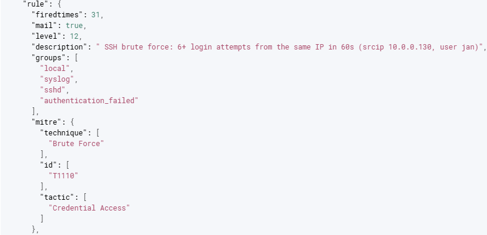
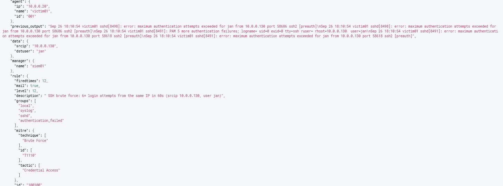
*Rule `100100` firing: level 12, my description with `srcip`/`dstuser` populated, MITRE T1110. The event even carries `previous_output` showing the raw failed-login lines that triggered it.*

**MITRE ATT&CK:** `T1110` Brute Force · **Custom rule:** [`detections/local_rules.xml`](detections/local_rules.xml)


### Exercise 2: Web Scanning + Onboarding a New Log Source

**Attack.** Directory brute-forcing (Gobuster) and a full vulnerability scan (Nikto).

```bash
gobuster dir -u http://10.0.0.20 -w /usr/share/wordlists/dirb/common.txt
nikto -h http://10.0.0.20
```

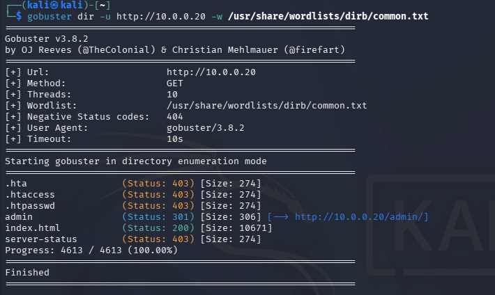
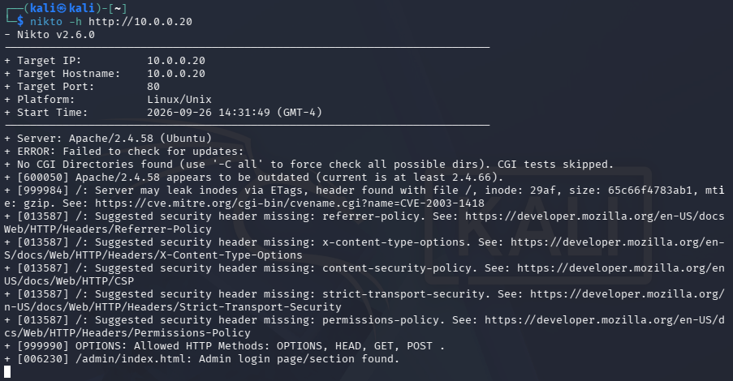

**Onboard.** Wazuh wasn't watching web traffic yet. I added the Apache access log as a new telemetry source on the agent and fixed the read-permission issue:

```xml
<localfile>
  <log_format>apache</log_format>
  <location>/var/log/apache2/access.log</location>
</localfile>
```
```bash
sudo usermod -a -G adm wazuh && sudo systemctl restart wazuh-agent
```

**Detect.** The scan generated **~8,900 web alerts** from a single source - the classic "wall of 400/404s"  and Nikto's Shellshock probe was caught as a **critical (level 15) CVE-2014-6271 alert**.

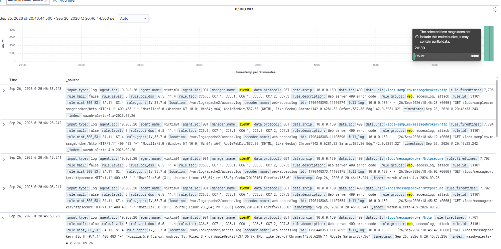
*~8,900 web-server error alerts from 10.0.0.130 - automated scanning, plainly visible.*

**MITRE ATT&CK:** `T1595` Active Scanning · `T1190` Exploit Public-Facing Application (Shellshock)


### Exercise 3 - SQL Injection with sqlmap

**Attack.** Automated SQL injection against DVWA, dumping the user table.

```bash
sqlmap -u "http://10.0.0.20/dvwa/vulnerabilities/sqli/?id=1&Submit=Submit" \
  --cookie="PHPSESSID=<session>; security=low" --batch --dbs
sqlmap -u "...same URL..." --cookie="..." --batch -D dvwa -T users --dump
```

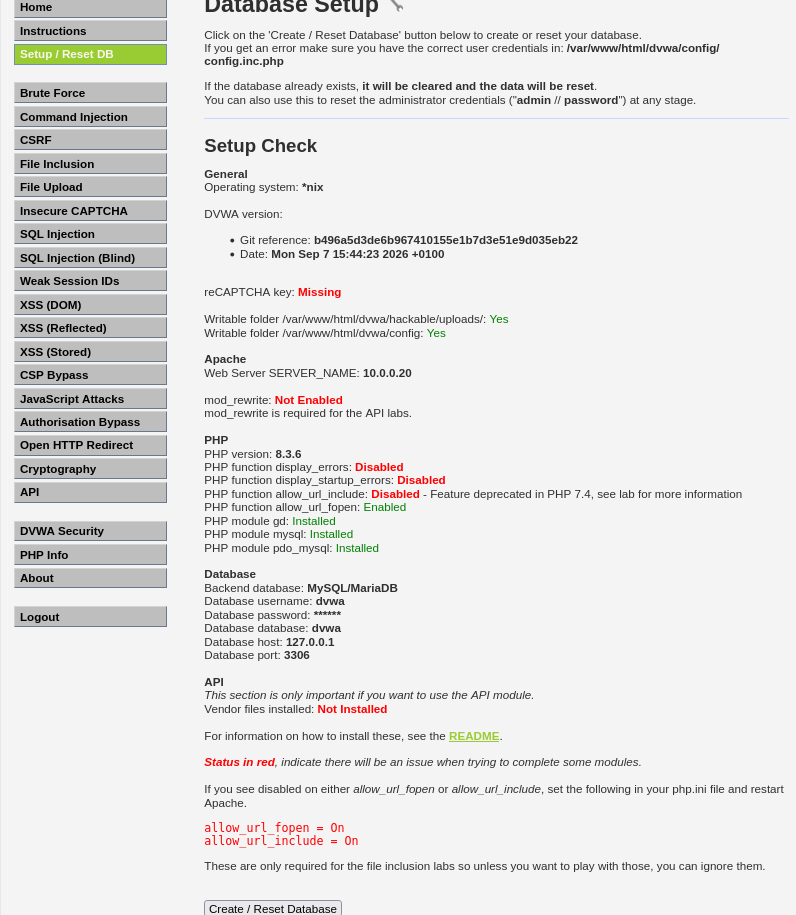
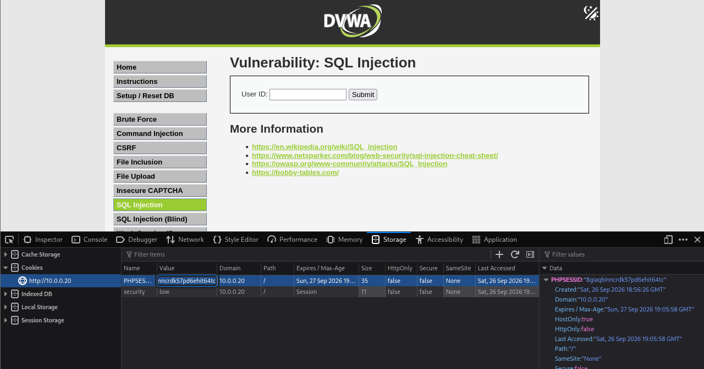
*DVWA stood up as the vulnerable target; session cookie captured for the authenticated sqlmap run.*

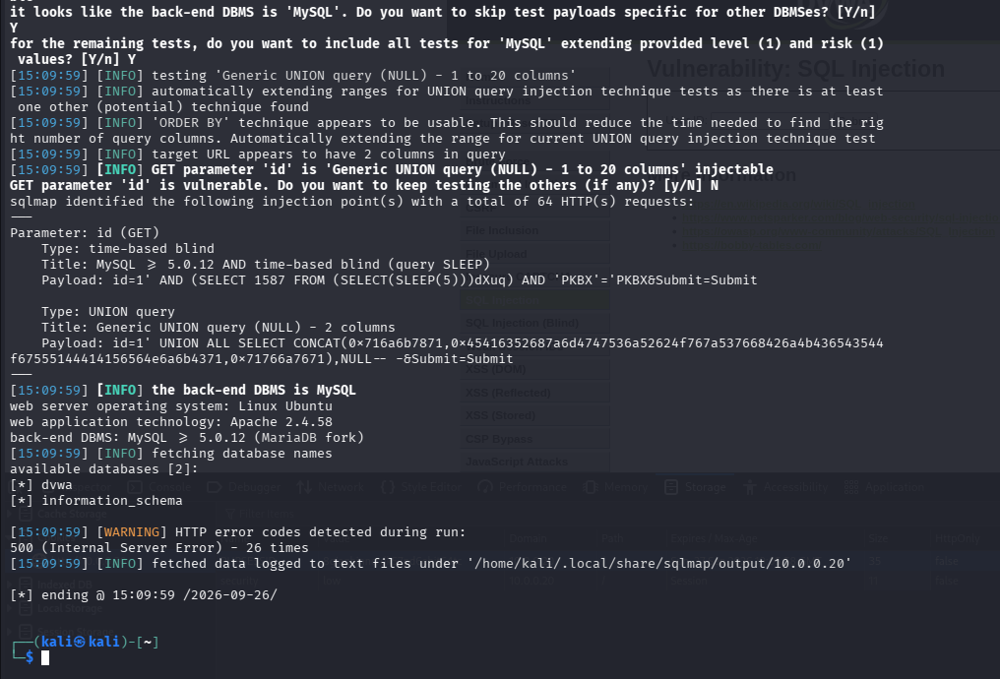
*`id` parameter confirmed injectable (time-based blind + UNION); databases enumerated.*

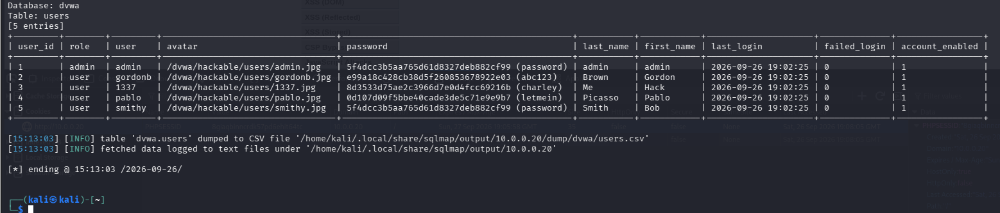
*The `users` table dumped - and sqlmap cracked the hashes (admin/password, gordonb/abc123, 1337/charley, pablo/letmein, smithy/password).*

**Detect.** sqlmap's payloads landed **directly in the web logs** - Wazuh captured **~9,814 alerts** where `data.url` contains the raw injection (`UNION ALL SELECT ... FROM information_schema`, and one extracting the `password` column from `dvwa.users`).

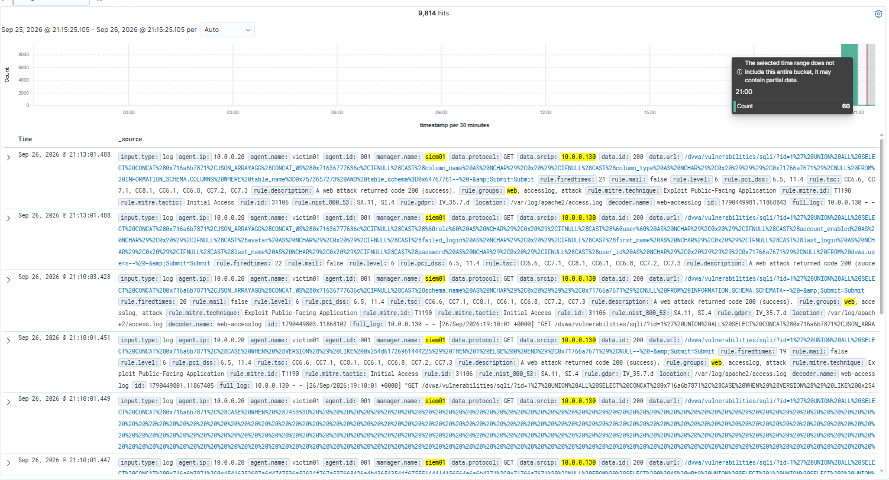
*The attacker's SQL payloads captured verbatim in the SIEM - including the query stealing the password column.*

**Analyst takeaway:** even for a *blind* injection, the full payload is recorded in the URL, so a defender can reconstruct exactly what data the attacker attempted to exfiltrate. Web-log retention matters.

**MITRE ATT&CK:** `T1190` Exploit Public-Facing Application


## MITRE ATT&CK Coverage (Phase 1)

| Tactic | Technique | Exercise |
|---|---|---|
| Credential Access | T1110 - Brute Force | SSH brute force (+ custom rule) |
| Reconnaissance | T1595 - Active Scanning | Gobuster / Nikto |
| Initial Access | T1190 - Exploit Public-Facing Application | Shellshock, SQL injection |


## Lessons Learned

The real problems I hit and solved - the most valuable part of the project:

- **`same_source_ip` is a rule *element*, not an attribute.** `wazuh-analysisd -t` rejected my first rule; reading the validation error taught me the correct XML structure.
- **"No results" usually means a filtered *view*, not a failed detection.** My level-12 alert was invisible until I removed a `rule.level: 7 to 11` filter that was hiding it.
- **`localhost` vs `127.0.0.1` are different hosts to MySQL.** DVWA threw a 500 on DB setup; the Apache error log pinpointed `Access denied for 'dvwa'@'localhost'`, caused by a grant/host mismatch and a chained `mysql -e` aborting after the first failed statement.
- **SSH brute force is slow by design.** Full rockyou over SSH was projected at 900+ hours - OpenSSH's connection limits are themselves a mild defense. I used a short list to demonstrate the crack while the initial run supplied the failed-login volume for detection.
- **Log onboarding needs permissions, not just config.** The `wazuh` agent user had to join the `adm` group to read Apache logs before events flowed.
- **Version compatibility matters.** I initially grabbed the newest Ubuntu (26.04) but rolled back to 24.04 LTS, which Wazuh 4.14 officially supports - caught it by spotting the `resolute` codename in the installer.


## Repository Structure

```
blue-team-home-lab/
├── README.md                    # this file (Phase 1)
├── detections/
│   └── local_rules.xml          # my custom Wazuh rule (100100)
├── configs/
│   └── apache-localfile.xml     # the agent log-onboarding block
├── build-log.md                 # chronological build notes & fixes
└── screenshots/                 # evidence (see index below)
```


## Screenshot Index

Put your captures in `screenshots/` with these exact names so every image renders:

| File | Shows |
|---|---|
| `00-dashboard-severity.png` | Wazuh 24h severity summary |
| `01-vmnet2-network.png` | VMware host-only network (VMnet2) |
| `02-siem01-hardware.png` | siem01 VM hardware (6 GB, dual NIC) |
| `03-siem01-ip-config.png` | siem01 static IP 10.0.0.10 |
| `04-siem01-storage.png` | siem01 LVM expanded to full disk |
| `05-siem01-ip-ping.png` | siem01 `ip a` + internet reachable |
| `06-wazuh-install-complete.png` | Wazuh install finished (creds redacted) |
| `07-victim01-hardware.png` | victim01 VM hardware (2 GB) |
| `08-victim01-ip-config.png` | victim01 static IP 10.0.0.20 |
| `09-victim01-storage.png` | victim01 storage |
| `10-agent-deploy-wizard.png` | Wazuh "Deploy new agent" wizard |
| `11-victim01-agent-active.png` | Agent Active in dashboard |
| `12-kali-vm-settings.png` | Kali attacker VM on VMnet2 only |
| `13-nmap-scan.png` | Nmap service scan (port 22) |
| `14-hydra-bruteforce.png` | Hydra recovering the password |
| `15-wazuh-bruteforce-events.png` | Failed-login events in Wazuh |
| `16-custom-rule-100100.png` | Custom rule definition (JSON) |
| `17-custom-rule-event.png` | Custom rule firing with `previous_output` |
| `18-gobuster.png` | Gobuster directory brute force |
| `19-nikto.png` | Nikto vulnerability scan |
| `20-wazuh-web-scan.png` | ~8,900 web-scan alerts |
| `21-dvwa-setup.png` | DVWA setup / database ready |
| `22-dvwa-sqli-cookie.png` | DVWA SQLi page + session cookie |
| `23-sqlmap-dbs.png` | sqlmap confirms injection + databases |
| `24-sqlmap-dump.png` | Dumped + cracked DVWA credentials |
| `25-wazuh-sqli.png` | SQLi payloads captured in the SIEM |


*Built and documented by Maks as a hands-on blue-team learning project. Phase 1: a Linux detection lab with a custom Wazuh rule, an onboarded log source, and three attack classes detected end-to-end.*
